# ASIX2_Gestor de Contraseñas_GTX <br> Trabajo realizado por Gerard Soteras, Tim Kalugin y Xavi Conde

## Explicación de la idea del proyecto
En este proyecto nos vamos a centrar en crear una aplicación web que funcione como un gestor de contraseñas. La idea es que esta web permita crear un usuario y que pueda añadir sus aplicaciones, webs, usuarios y contraseñas de forma fácil e intuitiva, pero siempre con seguridad. Nos vamos a enfocar principalmente en el back-end, pero también intentaremos que el front-end esté bien diseñado para que sea accesible para cualquier usuario.
Nuestro gestor podrá almacenar todas las contraseñas de forma cifrada, y estarán gestionadas por una contraseña maestra (masterkey).

La seguridad que vamos a implementar como desarrolladores incluye: contraseñas cifradas, una base de datos segura, y una masterkey con un cifrado más robusto.
Para los usuarios, la seguridad se basará en dos cosas: su contraseña de usuario y la masterkey. Así, los usuarios podrán gestionar todas sus cuentas y contraseñas de manera centralizada, segura y sencilla.

## Objetivo que se persigue
Nuestro objetivo es crear una aplicación web que gestione usuarios y contraseñas de manera cifrada. Además, tendremos una BBDD segura protegida por una única contraseña maestra que será enlazada a la app. Queremos facilitar la vida a los usuarios para que gasten el tiempo mínimo en buscar, añadir o manejar sus datos personales de autenticación.

## Organización y roles del equipo
Al ser un grupo que en el primer año del grado ya trabajamos juntos en varios proyectos, la organización ha sido muy fácil.<br>
Hemos decidido que todos haremos de todo, pero cada uno tendrá un rol de “líder” en cada apartado en el que hemos distribuido el proyecto, este líder será el encargado únicamente de marcar el tempo y de comunicar al resto del grupo cómo vamos en relación con los objetivos y fechas acordados al inicio.<br>
Al final de cada clase se pondrá en común el trabajo de cada integrante, con el objetivo de que todas las personas en todo momento sepan que se ha hecho ese día y si algún día hay una baja, que se pueda seguir trabajando con normalidad.

En el aspecto de las tareas, todos haremos todas las tareas, sin excepción.
  - Xavi - Front-end y VMs
  - Gerard - Back-end cifrado y presentaciones(PP, Genially…), escritos(GitHub)
  - Tim - Back-end BBDD y gestores de tareas

> [!IMPORTANT]
> Los líderes informan del tiempo, no quiere decir que trabajen más en esas áreas que otro compañero.</p>

## Tecnologías a utilizar (lenguajes, framework, sistemas, software...)
  - Front-end: HTML, CSS con ayuda de Bootstrap.<br>
    Colores que usaremos en el front-end: #234C17 y #B5FFA6
  - Back-end: Python, Java Script e intentaremos PHP.
  - Base de Datos: Google Firebase.
  - Cifrado: según vayamos avanzando con el proyecto elegiremos una de las 3 opciones: AES-256, bcrypt/Argon2, PBKDF2.
  - Seguridad: TLS/SSL.
  - Software: Visual Studio, Google Firebase, GitHub, Bootstrap, Node.JS, Cloudflare.

>  [!NOTE]
>  Esta lista puede aumentarse conforme vayamos avanzando con el proyecto y adquiriendo nuevos conocimientos.</p>

## Arquitectura del sistema
Usaremos la arquitectura cliente-servidor de tres capas, la haremos en capas para así poder trabajar cada capa por separado y hacerlo de manera más sencilla y efectiva, para poder cumplir con los plazos de entrega.
- Las tres capas se dividirán:
    - Cliente: Esta parte interactuará con el usuario, es decir, la mayoría del front-end estará en esta capa.
    - Servidor: Manejará la parte lógica y la base de datos y se encargará del procesado de solicitudes. También se gestionará el cifrado y las contraseñas
    - BBDD: Aquí se almacenarán los datos persistentes, como las contraseñas cifradas y las cuentas de usuario.
<br>

  | Máquina       | S.O                  | Almacenamiento / Memoria| Servicio     | 
  |---------------|----------------------|-------------------------|--------------|
  | **Proxmox**   |Proxmox-VE 8.2        | 93Gb / 8Gb              |  Hypervisor  |
  | **Router**    |Ubuntu server 22.04.2 | 14Gb / 4Gb              |  DHCP        |
  | **Cliente**   |Ubuntu server 22.04.2 | 14Gb / 4Gb              |      -       |
  | **FireBase**  |Ubuntu server 22.04.2 | 14Gb / 4Gb              |Base de datos |
  | **Pi-Hole**   | -                    | -                       |      DNS     |
  | **NGinx**     | -                    | -                       |      Web     |

# Estilo web
## MockUp
Como se muestra en el mockup, nuestra web será sencilla. Cuando entremos a la web por primera vez, nos encontraremos con un panel sencillo que nos dará dos opciones, "Iniciar sesión" y "Registrarse".<br>
Cada opción nos mandará a la página correspondiente, cuyo diseño será parecido al ya visto, con la diferencia que los títulos referenciarán dónde nos encontramos.

En la página de registrarse nos saldrá un pequeño "cuestionario" que nos solicitará correo electrónico, contraseña para entrar y nombre de usuario. Además, habrá un botón que permitirá ir a la página de iniciar sesión si ya tienes una cuenta registrada.

En la página de iniciar sesión nos mostrará los espacios correspondientes para introducir el usuario y la contraseña previamente registrada en la web. También estará disponible la opción de "¿Has olvidado tu contraseña?", "¿No tienes cuenta? Regístrate ya", la casilla para activar si quieres recordar el dispositivo y un ojo que mostrará la contraseña, ya que cuando se escribe no se muestra.

Una vez dentro, nos mostrará una ventana que pedirá registrar la llave maestra. Una vez configurada, el diseño de la web será simple. Se mostrarán las aplicaciones que hemos guardado en el gestor, con un botón que agregará una aplicación en la parte superior.  
A la hora de registrar una aplicación, se pedirá la URL del sitio web de la aplicación, el usuario y si se quiere generar una contraseña o introducir una personal. También habrá un espacio para poner comentarios. Una vez configurado, se usará un botón con "Guardar" para finalizar la acción de agregar una aplicación.  

Una vez tengamos algunas aplicaciones registradas, seleccionando alguna de ellas accederemos a una ventana donde se mostrará la información previamente introducida para la aplicación correspondiente y dos botones: "Editar" y "Eliminar", además de una cruz en la parte superior por si queremos salir de la ventana, regresando a la vista general de la web.

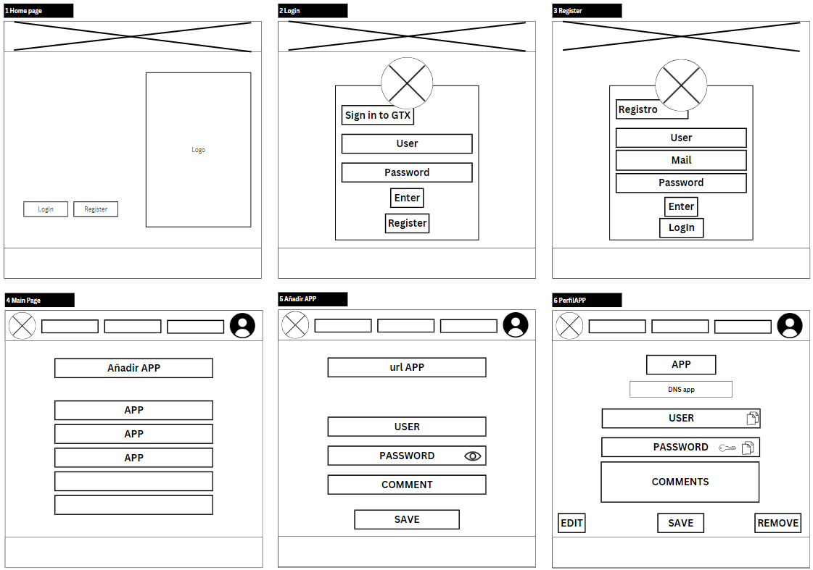

<h2>Árbol Web</h2>
Como se puede ver en la imagen del árbol web, hemos optado por crear una página sencilla e intuitiva para el usuario. Para mejorar la experiencia, hemos diseñado la navegación de forma que el usuario necesite hacer el menor número de clics posible para acceder a todas las funcionalidades de nuestra web.

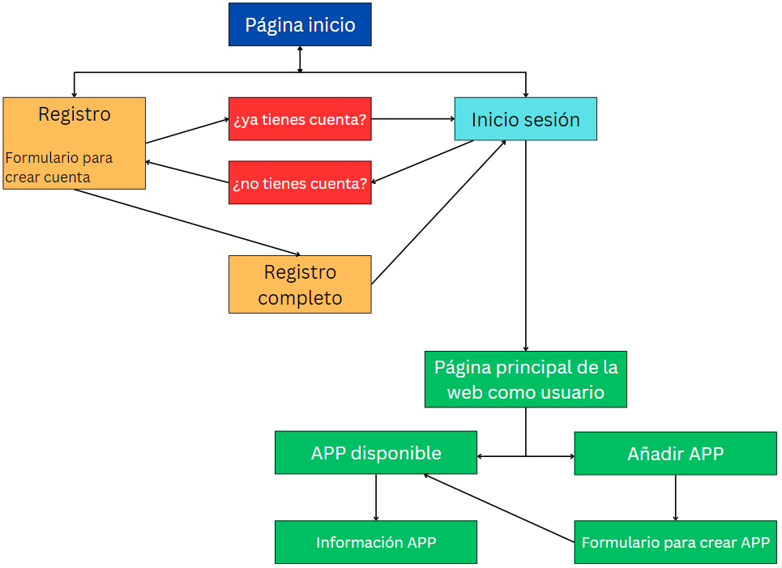

## Colores
Hemos optado por una paleta de colores en tonos verdes, que van desde un verde oscuro (#234C17) a un verde más claro (#B5FFA6). Estos colores están pensados para transmitir una sensación de seguridad, estabilidad y confianza, características fundamentales en un gestor de contraseñas. El verde también está asociado con zonas seguras y aprobadas, lo que refuerza la idea de que los usuarios estarán en un entorno protegido para almacenar su información sensible. Además, los colores blanco (#ffffff) y negro (#000000) se usan como base para asegurar legibilidad y simplicidad, sin distraer la atención de la funcionalidad principal de la plataforma.

  

## Logotipo
El logotipo elegido es un escudo verde con una cerradura en el centro, lo que simboliza la protección de las contraseñas, que actúan como llaves para acceder a las diferentes cuentas de los usuarios. El escudo representa seguridad, confiabilidad y defensa, lo que refuerza el objetivo del gestor de contraseñas: proporcionar un entorno seguro para almacenar y gestionar de manera centralizada los datos de autenticación. 
El detalle del circuito en el fondo del escudo agrega un toque tecnológico, conectando el concepto de ciberseguridad con el propósito del proyecto.

  

# PROXMOX
Para la creación de nuestro proyecto, vamos a usar Proxmox. Utilizaremos uno de los ordenadores disponibles en el aula para montar nuestro equipo PROXMOX, con el que trabajaremos para crear todos los servicios que necesitamos.

## Entorno ProxMox
Dentro de Proxmox, configuraremos una red NAT para que todas las máquinas virtuales que creemos tengan conexión entre ellas.
Como elementos principales, tendremos dos Ubuntu Servers. Uno de ellos hará de router virtual, proporcionando DHCP. El otro será un equipo cliente. 
Una vez tengamos estas dos máquinas configuradas correctamente, procederemos a crear e integrar una máquina que funcionará como base de datos y otra que proporcione servicio DNS.

Para crear la red NAT con la que se comunicarán las máquinas dentro de Proxmox, añadiremos un "Linux Bridge" y lo configuraremos para crear la red "interna", a la que llamaremos vmbr1. Por defecto, la red externa (en nuestro caso la del aula) se llama vmbr0.
El proceso que seguimos fue el siguiente: primero, instalamos y configuramos la máquina router. Al añadir la máquina, le asignamos la nueva interfaz de red que creamos anteriormente en el apartado de hardware. Una vez configurado el router, duplicamos la máquina para crear el equipo cliente, y modificamos el netplan para que tenga su propia dirección IP dentro de la red interna. En los anexos dejamos el primer borrador de la arquitectura de red que hicimos.

> 📎 [**Ver _anexo 1_ para configuración de entorno PROXMOX**](#anexo-1-configuración-de-entorno-proxmox)
> 🚩 [Ver informe de errores.](#errores-pi-hole-dns-server)

## Arquitectura de Red
Para nuestro proyecto, hemos configurado una red local utilizando Proxmox, en la cual hemos desplegado todos los servicios esenciales para nuestro gestor de contraseñas. En la imagen, se puede observar cómo hemos dividido el "Entorno Aula" y el "Entorno Proxmox".

En el Entorno Aula (con la red 100.77.20.0/24), contamos con acceso a internet y dispositivos físicos que se comunican con el router, mientras que en el Entorno Proxmox (red 10.20.30.0/24), hemos creado una red privada donde residen los servidores y servicios internos, proporcionando un entorno controlado para nuestro sistema.

Cada dispositivo en Proxmox cumple un rol específico:

- Router: conecta ambas redes, actúa como gateway y distribuye direcciones IP mediante DHCP en la red de Proxmox.
- Pi-hole (10.20.30.2): configurado como servidor DNS, filtra y redirige las solicitudes DNS dentro de la red interna.
- Cliente Nginx (10.20.30.20): ofrece el servicio web (Nginx) accesible desde la red del aula mediante una regla en IPTables.
- Firebase: proporciona los servicios de base de datos y almacenamiento necesarios para el funcionamiento del gestor de contraseñas.
En la imagen, los dispositivos que ofrecen servicios se encuentran subrayados en verde, mientras que aquellos que consumen servicios están subrayados en rojo.
También se ha indicado si las IPs son estáticas para facilitar la configuración y el acceso a cada servicio. De esta forma, el diseño asegura que cada dispositivo esté claramente identificado y cumpla su función en la red interna de Proxmox.

### Arquitectura de red final

<div align="center">

  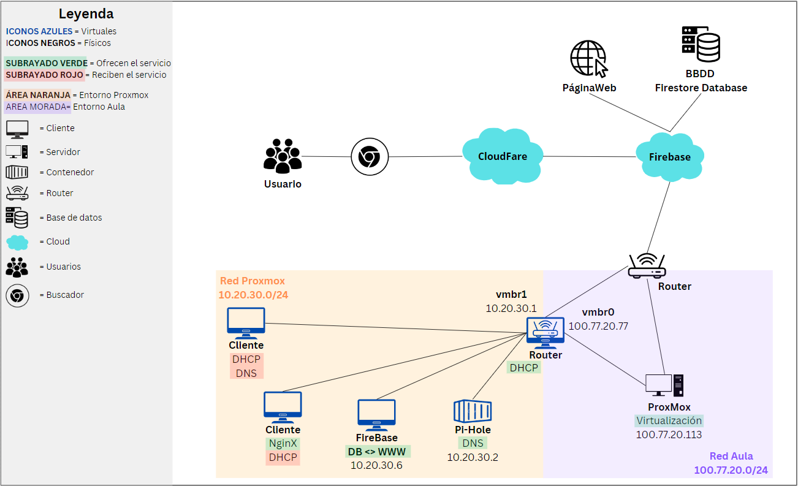

  <br>

| Máquinas         | IP                                         | IP Gateway                          | Red                           |
|------------------|--------------------------------------------|-------------------------------------|-------------------------------|
| Proxmox          | 100.77.20.113                              | 100.77.20.1                         | 100.77.20.0/24                |
| VM Ubuntu Router | 100.77.20.77 (externa)<br>10.20.30.1 (interna) | 100.77.20.1 (externa)<br>10.20.30.1 (interna) | vmbr0 (100.77.20.0/24)<br>vmbr1 (10.20.30.0/24) |
| VM Ubuntu Cliente| DHCP                                       | 10.20.30.1                          | vmbr1 (DHCP)                  |
| Nginx            | DHCP                                       | 10.20.30.1                          | vmbr1 (DHCP)                  |
| Pihole           | 10.20.30.5                                 | 10.20.30.1                          | vmbr1 (10.20.30.0/24)         |
</div>

## Configuración de red para el "ROUTER"
Primero configuramos la red del router. Para ello cambiaremos el netplan ajustando las IP según la red interna previamente creada o la externa.Con ens18 identificaremos la red exterior y con ens19 la red interna.
Además, hemos implementado el servicio de DHCP en el router para que todos los dispositivos que estén dentro de la red virtual puedan obtener una IP sin necesidad de asignarla manualmente.

### Configuración de DHCP
Para configurar el servicio DHCP, primero lo instalaremos en el router con el comando correspondiente. Luego crearemos una copia de seguridad del archivo de configuración para conservar la configuración original. Procederemos a editar el archivo de configuración y, en nuestro caso, hemos asignado el rango de IPs de *10.20.30.20* a *10.20.30.50*.

También configuraremos la IP *10.20.30.20* para que siempre se asigne a la máquina que contiene el servicio de Nginx. Esto nos permitirá abrir el puerto 80 con IPTables y dirigirlo hacia esta dirección IP, logrando que podamos acceder a nuestra página de Nginx desde los ordenadores del aula. Además, modificaremos el archivo ```isc-dhcp-server``` para indicar al router que funcione como servidor DHCP en la interfaz ens19.

```
# comandos usados

sudo apt install isc-dhcp-server                        # instalación del servicio
sudo cp /etc/dhcp/dhcpd.conf /etc/dhcp/dhcpd.conf.BKP   # creación de la copia de archivo
sudo nano /etc/dhcp/dhcpd.conf                          # modificación del archivo de configuración
sudo nano /etc/default/isc-dhcp-server                  # modificación del archivo de asiganción de interfaz
```

### Configuración de IPTables
Para permitir que el cliente tenga acceso a la red exterior, debemos instalar y configurar IPTables en el router para habilitar el redireccionamiento del tráfico. Para ello, modificaremos el archivo ```/etc/sysctl.conf```. Dentro de este archivo, descomentaremos una línea que permitirá reenviar el tráfico entre las diferentes interfaces de red hacia el router que tenemos en Proxmox.

También añadiremos una regla para permitir el tránsito por el puerto 80 y, de este modo, poder acceder al servicio de Nginx desde un ordenador del aula, que está fuera de la red interna de Proxmox.

En el archivo de configuración, verificaremos si hay alguna regla habilitada en IPTables y añadiremos una nueva para realizar el enmascaramiento NAT en el tráfico saliente de la interfaz de red ens18. Configuraremos una regla que permita que el tráfico de la red interna fluya hacia la red externa. Por último, añadiremos una regla adicional para que las solicitudes desde la red interna puedan regresar, logrando así una comunicación bidireccional.

Una vez finalizadas las configuraciones de IPTables, guardaremos dichas reglas con el comando adecuado. Para que las reglas de IPTables se mantengan después de reiniciar el sistema, instalaremos el paquete *iptables-persistent*.

```
# comandos usados para la configuración principal de IPtables

sudo iptables -t nat -A POSTROUTING -o ens18 -j MASQUERADE                                 # regla de enmascaramiento NAT en el tráfico saliente
sudo iptables -A FORWARD -i ens18 -o ens19 -j ACCEPT                                       # regla para permitir el tráfico de la red interna hacia la externa
sudo sysctl -p                                                                             # aplicación de las nuevas reglas
sudo iptables -A FORWARD -i ens19 -o ens18 -m state --state ESTABLISHED,RELATED -j ACCEPT  # regla para permitir el tráfico de retorno
sudo iptables-save                                                                         # guardar reglas de IPtables
```

Para permitir que los ordenadores del aula puedan conectarse a nuestro servicio de Nginx en el puerto 80 (IP externa: 100.77.20.77:80), hemos añadido una nueva regla en IPTables para redirigir el tráfico al servidor Nginx.

```
# comando usado para añadir regla de reenvio de puerto 80

sudo iptables -t nat -A PREROUTING -i ens18 -p tcp --dport 80 -j DNAT --to-destination 10.20.30.20:80
```


> 📎 [**Ver _anexo 2_ para configuración del Router**](#anexo-2-configuración-del-router)

## Configuración de red para el "CLIENTE"
Configuramos la red del router cambiando el netplan para usar la interfaz ens19 con una IP dentro de la red. Como aún no hemos configurado ningún servicio DHCP, asignaremos la IP estática 10.20.30.5.
Una vez tengamos el servicio DHCP configurado, modificaremos nuevamente el netplan para conseguir que la interfaz obtenga una IP dinámica.

> 📎[**Ver _anexo 3_ para configuración del Cliente**](#anexo-3-configuración-del-cliente)

## Comprobación de conexión entre máquinas
Una vez configurado el netplan tanto en el router como en el cliente, realizamos un ping entre ambas máquinas para comprobar que hay conexión dentro de la red NAT que hemos creado.
Tras verificar el correcto funcionamiento de la red, haremos un ping desde el router y el cliente hacia la red exterior, como por ejemplo a "google.com". Si obtenemos conexión, podremos concluir que tanto el router como el cliente están bien configurados.

> 📎 [**Ver _anexo 4_ para verificación de configuración**](#anexo-4-verificación-de-configuración)

## Configuración QEMU
Instalaremos tanto en la máquina cliente como en la máquina router el paquete qemu-guest-agent. Gracias a esto, podremos administrar las máquinas virtuales de una manera más fácil.
Una vez instalado en las máquinas, debemos configurar las máquinas virtuales en las opciones que nos ofrece Proxmox.

> 📎 [**Ver _anexo 5_ para configuración QEMU Proxmox**](#anexo-5-configuración-qemu-proxmox)

# Servidor DNS
Para crear un servidor DNS dentro de nuestra red interna, hemos decidido usar la herramient pi-hole y ejecutarla dentro de un contenedor ya que nunca habiamos usado pihole ni contendores y asi hemos podido hacer una primera toma de contacto con ambos.
Despues de crear el contenedor de proxmox con el hardware especificado en la tabla "Arquitectura del sistema" usamos el comando que te indican en la pagina oficial de pi-hole
```
git clone --depth 1 https://github.com/pi-hole/pi-hole.git Pi-hole
cd "Pi-hole/automated install/"
sudo bash basic-install.sh
```
Lo tenemos que hacer con "git clone" ya que en el propio contenedor el comando "curl" no lo reconoce. 
Una vez hecho esto trabajaremos todo el servidor DNS dentro del archivo ```/etc/resolv.conf```.
Pondremos todas las lineas de ese archivo, comentadas.
Añadiremos la linea "nameserver 127.0.0.1" para que el mismo contenedor de pi-hole sea su propio servidor DNS.

> 🚩 [Ver informe de errores.](#errores-pi-hole-dns-server)

# Base de datos
Para nuestro proyecto, crearemos una máquina que alojará nuestra base de datos. En lugar de usar una base de datos relacional como MySQL, optaremos por una base de datos no relacional gracias a Firebase.

> [!WARNING]
> Falta añadir info

Los datos obtenidos de los usuarios se almacenará de la siguiente manera:

```
APPS (Colección)
├── app_id_1
│   ├── nombre_app: ""           (Nombre de la aplicación)
│   └── url_app: ""              (URL de la aplicación)

USUARIOS (Colección)
├── user_id_1
│   ├── email: ""                (Correo electrónico del usuario)
│   ├── nombre: ""               (Nombre del usuario)
│   ├── password_registro: ""    (Contraseña del registro, debe estar hasheada)
│   ├── master_key: ""           (Clave maestra para cifrado/descifrado)
│   └── passwords                (Colección de contraseñas)
│       ├── password_1
│       │   ├── nombre_app: ""   (Nombre de la aplicación)
│       │   ├── username_app: "" (Nombre de usuario en la app)
│       │   └── password_app: "" (Contraseña de la app, cifrada)
│       ├── password_2
│       │   ├── nombre_app: ""   (Nombre de la aplicación)
│       │   ├── username_app: "" (Nombre de usuario en la app)
│       │   └── password_app: "" (Contraseña de la app, cifrada)
│       └── ...
└── user_id_2
    └── ...
```


<hr>

# 📎 Anexos
## Anexo 1 (configuración de entorno PROXMOX)
### Adaptador puente

### Interfaz de red para el router
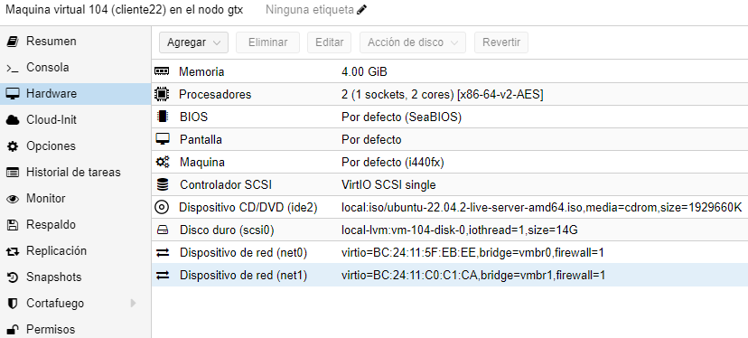
### Borrador de arquitectura de red inicial
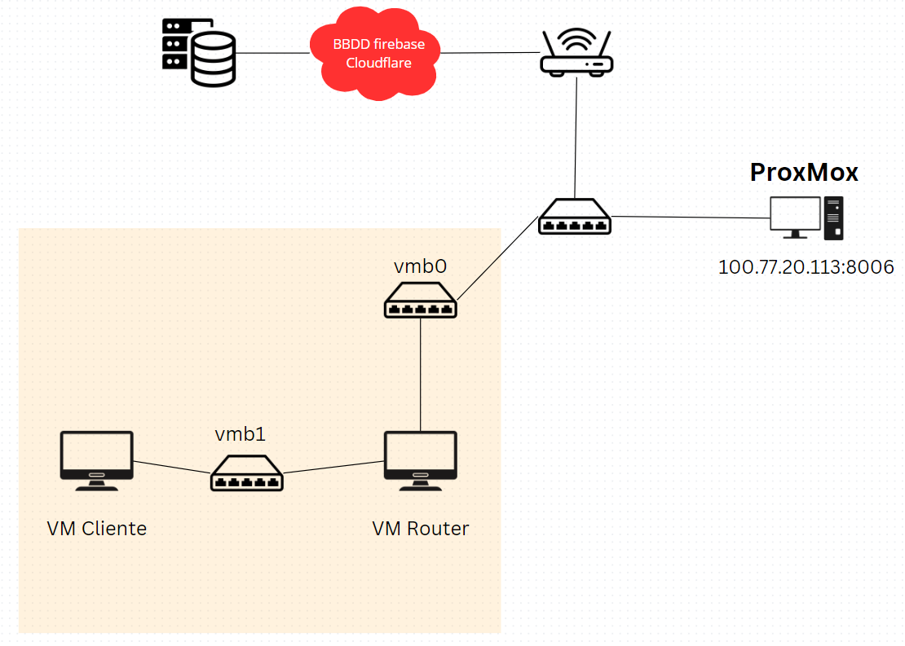
## Anexo 2 (configuración del Router)
### Netplan del router

### Archivo sysctl
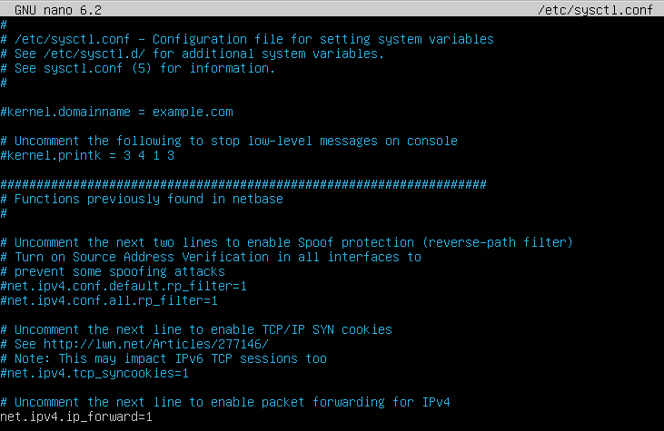
### Archivo de configuración DHCP en el router
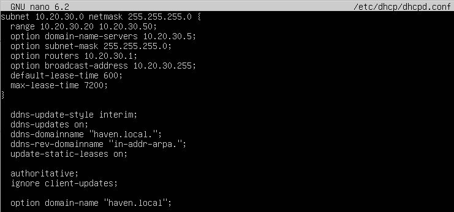
### Archivo de configuración DHCP-ISC en el router

### Configuración IPtables
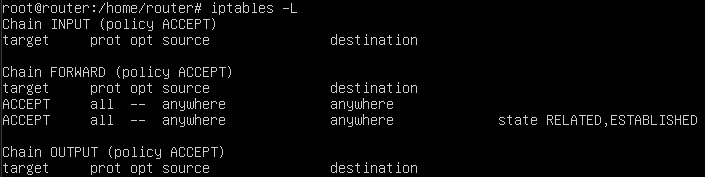
### Instalación IPtablesPersistent
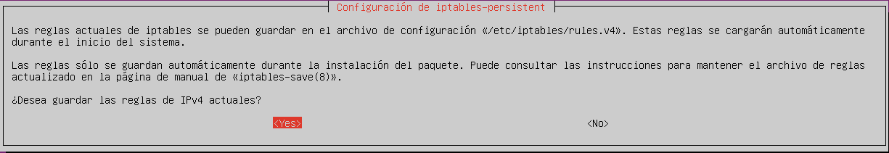
## Anexo 3 (configuración del Cliente)
### Netplan inicial del cliente con IP estática
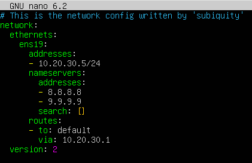
### Netplan final del cliente con IP dinámica
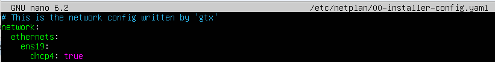
## Anexo 4 (verificación de configuración)
### Conexión entre máquinas
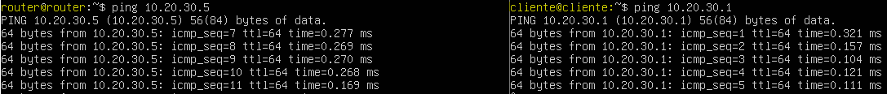
### Conexión hacia red exterior con IP estática
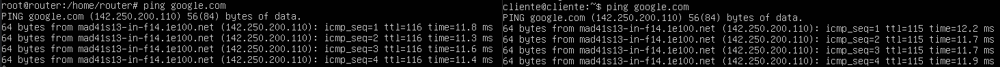
### Conexión hacia red exterior con IP dinámica + comprovación de conexión hacia la red exterior.
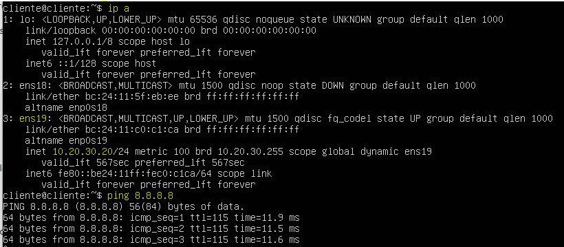
## Anexo 5 (configuración QEMU Proxmox)


<hr>

# 🚩 Informe de errores
En este apartado se encuantran todas las dificultades y errores que han ido surgiendo a medida que progresava el proyecto.

## Errores con el router
Por fallos a la hora de escribir la identación del netplan, hubo dificultades a la hora de configurar el router.
También tubimos problemas 

## Errores Pi-hole DNS Server
En la version de **Proxmox 8.2.2**, el archivo ```/etc/resolv.conf``` se sobrescribe automáticamente dos veces al reiniciar el contenedor debido a:

**1a vez:** *Servicio systemd-resolved:* Modifica el archivo de configuración DNS, de manera automática.

**2a vez:** *Proxmox:* Sobrescribe el archivo durante el inicio del contenedor.

Esto provoca que:
  **No** podemos modificar manualmente el archivo /etc/resolv.conf.
  **No** se pueden ejecutar scripts que cambien el archivo en el arranque del contenedor.
  **No** se puede filtrar el tráfico DNS adecuadamente.
  El DNS **siempre** se establece en 8.8.8.8, ignorando configuraciones internas.
  Entre muchas otras conseqüencias...
  
:white_check_mark:**SOLUCIÓN**

**Paso 1:** *Detener el servicio systemd-resolved*

Detenemos el servicio para evitar que sobrescriba el archivo DNS.
```
systemctl disable systemd-resolved
systemctl stop systemd-resolved
```
**Paso 2:** *Configurar DNS en cada arranque. utilizando ```crontab```*

Modificar el archivo crontab, ya que este archivo ejecuta instrucciones de manera persistente.
```
#Localizacion del archivo /tmp/crontab.RwAtVi/crontab
crontab -e
@reboot echo "nameserver 127.0.0.1" > /etc/resolv.conf #Añadir esta linea, dentro del archivo
```
Esta línea asegura que el archivo ```/etc/resolv.conf``` apunte al servidor DNS local (127.0.0.1) en cada reinicio, evitando sobrescrituras por parte de Proxmox o systemd-resolved.
Con estos pasos, se asegura que el contenedor de Pi-hole utilice su propio servidor DNS de manera persistente, permitiendo un filtrado efectivo del tráfico DNS y manteniendo la configuración deseada entre reinicios.
