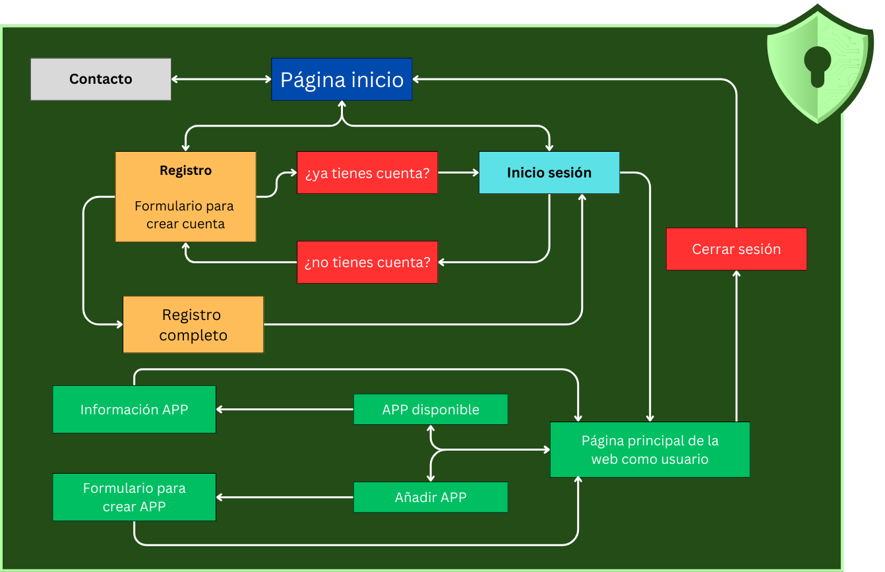

<h1>ASIX2_Gestor de Contraseñas_GTX 
Trabajo realizado por Gerard Soteras, Tim Kalugin y Xavi Conde </h1>

<h2>Explicación de la idea del proyecto</h2>

En este proyecto nos vamos a centrar en crear una aplicación web que funcione como un gestor de contraseñas. La idea es que esta web permita crear un usuario y que pueda añadir sus aplicaciones, webs, usuarios y contraseñas de forma fácil e intuitiva, pero siempre con seguridad. Nos vamos a enfocar principalmente en el back-end, pero también intentaremos que el front-end esté bien diseñado para que sea accesible para cualquier usuario.
Nuestro gestor podrá almacenar todas las contraseñas de forma cifrada, y estarán gestionadas por una contraseña maestra (masterkey).

La seguridad que vamos a implementar como desarrolladores incluye: contraseñas cifradas, una base de datos segura, y una masterkey con un cifrado más robusto.
Para los usuarios, la seguridad se basará en dos cosas: su contraseña de usuario y la masterkey.
Así, los usuarios podrán gestionar todas sus cuentas y contraseñas de manera centralizada, segura y sencilla.

<h2>Objetivo que se persigue</h2>

Nuestro objetivo es crear una aplicación web que gestione usuarios y contraseñas de manera cifrada. Además, tendremos una BBDD segura protegida por una única contraseña maestra que será enlazada a la app. Queremos facilitar la vida a los usuarios para que gasten el tiempo mínimo en buscar, añadir o manejar sus datos personales de autenticación.

<h2>Organización y roles del equipo</h2>

Al ser un grupo que en el primer año del grado ya trabajamos juntos en varios proyectos, la organización ha sido muy fácil.
Hemos decidido que todos haremos de todo, pero cada uno tendrá un rol de “líder” en cada apartado en el que hemos distribuido el proyecto, este líder será el encargado únicamente de marcar el tempo y de comunicar al resto del grupo cómo vamos en relación con los objetivos y fechas acordados al inicio.
Al final de cada clase se pondrá en común el trabajo de cada integrante, con el objetivo de que todas las personas en todo momento sepan que se ha hecho ese día y si algún día hay una baja, que se pueda seguir trabajando con normalidad.

En el aspecto de las tareas, todos haremos todas las tareas, sin excepción.
<ul>
  <li>Xavi - Front-end y VMs</li>
  <li>Gerard - Back-end cifrado y presentaciones(PP, Genially…), escritos(GitHub)</li>
  <li>Tim - Back-end BBDD y gestores de tareas</li>
</ul>

> [!IMPORTANT]
> Los líderes informan del tiempo, no quiere decir que trabajen más en esas áreas que otro compañero.

<h2>Tecnologías a utilizar (lenguajes, framework, sistemas, software...)</h2>

<ul>
  <li>Front-end: HTML, CSS con ayuda de Bootstrap. 
    Colores que usaremos en el front-end: #234C17 y #B5FFA6</li>
  <li>Back-end: Python, Java Script e intentaremos PHP.</li>
  <li>Base de Datos: Google Firebase.</li>
  <li>Cifrado: según vayamos avanzando con el proyecto elegiremos una de las 3 opciones: AES-256, bcrypt/Argon2, PBKDF2.</li>
  <li>Seguridad: TLS/SSL.</li>
  <li>Software: Visual Studio, Google Firebase, GitHub, Bootstrap, Node.JS, Cloudflare.</li>
</ul>

> [!NOTE]
> Esta lista puede aumentarse conforme vayamos avanzando con el proyecto y adquiriendo nuevos conocimientos.

<h2>Arquitectura del sistema</h2> 

Usaremos la arquitectura cliente-servidor de tres capas, la haremos en capas para así poder trabajar cada capa por separado y hacerlo de manera más sencilla y efectiva, para poder cumplir con los plazos de entrega.
<ul>Las tres capas se dividirán:
  <li>Cliente: Esta parte interactuará con el usuario, es decir, la mayoría del front-end estará en esta capa.</li>
  <li>Servidor: Manejará la parte lógica y la base de datos y se encargará del procesado de solicitudes. También se gestionará el cifrado y las contraseñas</li>
  <li>BBDD: Aquí se almacenarán los datos persistentes, como las contraseñas cifradas y las cuentas de usuario.</li>
</ul>

<h1>Estilo web</h1>
<h2>MockUp</h2>

Como se muestra en el mockup, nuestra web será sencilla. Cuando entremos a la web por primera vez, nos encontraremos con un panel sencillo que nos dará dos opciones, "Iniciar sesión" y "Registrarse".  
Cada opción nos mandará a la página correspondiente, cuyo diseño será parecido al ya visto, con la diferencia que los títulos referenciarán dónde nos encontramos.  
En la página de registrarse nos saldrá un pequeño "cuestionario" que nos solicitará correo electrónico, contraseña para entrar y nombre de usuario. Además, habrá un botón que permitirá ir a la página de iniciar sesión si ya tienes una cuenta registrada.  
En la página de iniciar sesión nos mostrará los espacios correspondientes para introducir el usuario y la contraseña previamente registrada en la web. También estará disponible la opción de "¿Has olvidado tu contraseña?", "¿No tienes cuenta? Regístrate ya", la casilla para activar si quieres recordar el dispositivo y un ojo que mostrará la contraseña, ya que cuando se escribe no se muestra.  

Una vez dentro, nos mostrará una ventana que pedirá registrar la llave maestra. Una vez configurada, el diseño de la web será simple. Se mostrarán las aplicaciones que hemos guardado en el gestor, con un botón que agregará una aplicación en la parte superior.  

A la hora de registrar una aplicación, se pedirá la URL del sitio web de la aplicación, el usuario y si se quiere generar una contraseña o introducir una personal. También habrá un espacio para poner comentarios. Una vez configurado, se usará un botón con "Guardar" para finalizar la acción de agregar una aplicación.  

Una vez tengamos algunas aplicaciones registradas, seleccionando alguna de ellas accederemos a una ventana donde se mostrará la información previamente introducida para la aplicación correspondiente y dos botones: "Editar" y "Eliminar", además de una cruz en la parte superior por si queremos salir de la ventana, regresando a la vista general de la web.

  

<h2>Árbol Web</h2>

  

<h2>Colores </h2>

Hemos optado por una paleta de colores en tonos verdes, que van desde un verde oscuro (#234C17) a un verde más claro (#B5FFA6). Estos colores están pensados para transmitir una sensación de seguridad, estabilidad y confianza, características fundamentales en un gestor de contraseñas. El verde también está asociado con zonas seguras y aprobadas, lo que refuerza la idea de que los usuarios estarán en un entorno protegido para almacenar su información sensible. Además, los colores blanco (#ffffff) y negro (#000000) se usan como base para asegurar legibilidad y simplicidad, sin distraer la atención de la funcionalidad principal de la plataforma.

  

<h2>Logotipo</h2>

El logotipo elegido es un escudo verde con una cerradura en el centro, lo que simboliza la protección de las contraseñas, que actúan como llaves para acceder a las diferentes cuentas de los usuarios. El escudo representa seguridad, confiabilidad y defensa, lo que refuerza el objetivo del gestor de contraseñas: proporcionar un entorno seguro para almacenar y gestionar de manera centralizada los datos de autenticación. El detalle del circuito en el fondo del escudo agrega un toque tecnológico, conectando el concepto de ciberseguridad con el propósito del proyecto.

  

<h1>PROXMOX</h1>

Para la creación de nuestro proyecto, vamos a usar Proxmox. Utilizaremos uno de los ordenadores disponibles en el aula para montar nuestro equipo PROXMOX, con el que trabajaremos para crear todos los servicios que necesitamos.

<h2>Entorno ProxMox</h2>

Dentro de Proxmox, configuraremos una red NAT para que todas las máquinas virtuales que creemos tengan conexión entre ellas. 
Como elementos principales, tendremos dos Ubuntu Servers. Uno de ellos hará de router virtual, proporcionando DHCP y actuando como servidor DNS. El otro será un equipo cliente. Una vez tengamos estas dos máquinas configuradas correctamente, procederemos a crear e integrar una máquina que funcionará como base de datos y otra que alojará nuestra página web.

**Ver _anexo 1_ para configuración del adaptador puente**

Para crear la red NAT con la que se comunicarán las máquinas dentro de Proxmox, añadiremos un "Linux Bridge" y lo configuraremos para crear la red "interna", a la que llamaremos vmbr1. Por defecto, la red externa (en nuestro caso la del aula) se llama vmbr0. 
El proceso que seguimos fue el siguiente: primero, instalamos y configuramos la máquina router. Al añadir la máquina, le asignamos la nueva interfaz de red que creamos anteriormente en el apartado de hardware. Una vez configurado el router, duplicamos la máquina para crear el equipo cliente, y modificamos el netplan para que tenga su propia dirección IP dentro de la red interna.

**Ver _anexo 2_ para configuración del hardware del cliente**

<h2>Arquitectura de Red</h2>

  

  |               | Proxmox              | VM Ubuntu Router       | VM Ubuntu Cliente     |
  |---------------|----------------------|------------------------|-----------------------|
  | **IP (estática)** | 100.77.20.113/24 | IP: 100.77.20.77/24    | IP: DHCP              |
  | **IP Gateway**    | 100.77.20.1      | 100.77.20.1            | 10.20.30.1            |
  | **Red**           | NAT              | vmbr0                  | vmbr1 (10.20.30.0/24) |
  |---------------|----------------------|------------------------|-----------------------|
  | **IP (estática)** | ---------------- | IP: 10.20.30.1/24      | ----------------      |
  | **IP Gateway**    | ---------------- | 100.77.20.1            | ----------------      |
  | **Red**           | ---------------- | vmbr1                  | ----------------      |

<h2>Configuración de red para el "ROUTER"</h2>

Configuramos la red del router. Para ello cambiaremos el netplan ajustando las IP según la red interna previamente creada o la externa.Con ens18 identificaremos la red exterior y con ens19 la red interna

**Ver _anexo 3_ para configuración netplan del router**

<h2>Configuración de red para el "CLIENTE"</h2>

Configuramos la red del router. Para ello cambiaremos el netplan con ens19 con una IP dentro de la red. Como aún no hemos configurado ningún servicio DHCP, asignaremos la IP estatica 10.20.30.5

**Ver _anexo 4_ para configuración netplan del router**

<h2>Comprobación de conexión entre máquinas</h2>

Una vez configurado el netplan tanto en el router como en el cliente, realizamos un ping entre ambas máquinas para comprobar que hay conexión dentro de la red NAT que hemos creado.   Tras verificar el correcto funcionamiento de la red, haremos un ping desde el router hacia la red exterior, como por ejemplo a "google.com". Si obtenemos conexión, podremos concluir que tanto el router como el cliente están bien configurados hasta este punto.

**Ver _anexo 5_ para ping entre maquinas**

<h2>Configuración de IPTables</h2>

Para permitir que el cliente tenga acceso a la red exterior, debemos instalar y configurar IPTables en el router para habilitar el redireccionamiento del tráfico. Para ello, modificaremos el archivo "/etc/sysctl.conf".   Dentro de este archivo, simplemente descomentaremos una línea que permitirá reenviar el tráfico entre las diferentes interfaces de red hacia el router que tenemos en Proxmox.

**Ver _anexo 6_ para configuración "sysctl.conf"**

Proseguiremos verificando si tenemos alguna regla de <b>IPTables</b> habilitada y configuramos una nueva introduciendo el siguiente comando: <b>iptables -t nat -A POSTROUTING -o ens18 -j MASQUERADE</b>. Gracias a este comando, realizaremos el enmascaramiento NAT en el tráfico saliente de la interfaz de red <b>ens18</b>.  Seguidamente, aplicaremos <b>sudo sysctl -p</b> y <b>sudo iptables -A FORWARD -i ens18 -o ens19 -j ACCEPT</b>. Con esto, hemos configurado una regla que nos permitirá que el tráfico de la red interna fluya hacia la red externa.  Por último, añadiremos otra regla que permita que las solicitudes desde la red interna puedan regresar. De ese modo, conseguiremos una comunicación bidireccional. El comando será el siguiente: <b>sudo iptables -A FORWARD -i ens19 -o ens18 -m state --state ESTABLISHED,RELATED -j ACCEPT</b>.  Para guardar los cambios hechos en <b>IPTables</b>, usamos el siguiente comando: <b>sudo iptables-save</b>. 

**Ver _anexo 7_ para configuración IPTables**

Para mantener las reglas de <b>IPTables</b> configuradas después de reiniciar el sistema, instalamos el paquete llamado <b>iptables-persistent</b>.

**Ver _anexo 8_ para panel IPTablesPersistent**

Para comprobar que la configuración es correcta, realizamos un ping hacia la red exterior desde el cliente y el router, por ejemplo, a "google.com".

**Ver _anexo 9_ para ping hacia Google**

<h1>Anexos</h1>
<h3>Anexo 1</h3>

<h3>Anexo 2</h3>

<h3>Anexo 3</h3>

<h3>Anexo 4</h3>

<h3>Anexo 5</h3>

<h3>Anexo 6</h3>

<h3>Anexo 7</h3>

<h3>Anexo 8</h3>

<h3>Anexo 9</h3>

